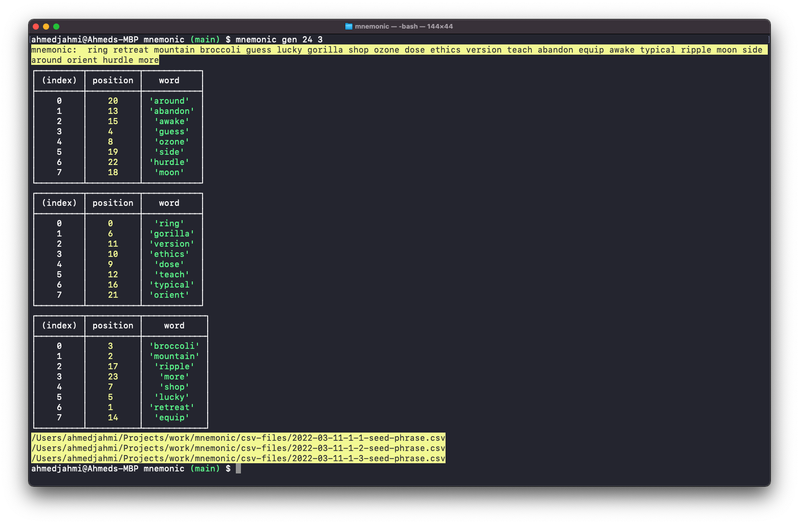

<div id="top"></div>
<!--
*** Thanks for checking out the Best-README-Template. If you have a suggestion
*** that would make this better, please fork the repo and create a pull request
*** or simply open an issue with the tag "enhancement".
*** Don't forget to give the project a star!
*** Thanks again! Now go create something AMAZING! :D
-->

<!-- PROJECT SHIELDS -->
<!--
*** I'm using markdown "reference style" links for readability.
*** Reference links are enclosed in brackets [ ] instead of parentheses ( ).
*** See the bottom of this document for the declaration of the reference variables
*** for contributors-url, forks-url, etc. This is an optional, concise syntax you may use.
*** https://www.markdownguide.org/basic-syntax/#reference-style-links
-->
<!-- [![Contributors][contributors-shield]][contributors-url]
[![Forks][forks-shield]][forks-url]
[![Stargazers][stars-shield]][stars-url]
[![Issues][issues-shield]][issues-url]
[![MIT License][license-shield]][license-url]
[![LinkedIn][linkedin-shield]][linkedin-url] -->

<!-- PROJECT LOGO -->
<br />
<div align="center">
  <a href="https://github.com/ahmedjahmi/mnemonic">
    
  </a>

  <p align="center">
    A CLI tool that generates a bip39 mnemonic phrase, shuffles the order of the words but maintains each word's position in the original phrase & prints the words and their position across n number of csv pages.
    <br />
    <a href="https://github.com/ahmedjahmi/mnemonic"><strong>Explore the docs »</strong></a>
    <br />
    <br />
    <a href="https://github.com/ahmedjahmi/mnemonic">View Demo</a>
    ·
    <a href="https://github.com/ahmedjahmi/mnemonic/issues">Report Bug</a>
    ·
    <a href="https://github.com/ahmedjahmi/mnemonic/issues">Request Feature</a>
  </p>
</div>

<!-- TABLE OF CONTENTS -->
<details>
  <summary>Table of Contents</summary>
  <ol>
    <li>
      <a href="#about-the-project">About The Project</a>
      <ul>
        <li><a href="#built-with">Built With</a></li>
      </ul>
    </li>
    <li>
      <a href="#getting-started">Getting Started</a>
      <ul>
        <li><a href="#prerequisites">Prerequisites</a></li>
        <li><a href="#installation">Installation</a></li>
      </ul>
    </li>
    <li><a href="#usage">Usage</a></li>
    <li><a href="#roadmap">Roadmap</a></li>
    <li><a href="#contributing">Contributing</a></li>
    <li><a href="#license">License</a></li>
    <li><a href="#contact">Contact</a></li>
    <!-- <li><a href="#acknowledgments">Acknowledgments</a></li> -->
  </ol>
</details>

<!-- ABOUT THE PROJECT -->

## About The Project

<div align="center">
  <a href="#">
    
  </a>
</div>

<p align="right">(<a href="#top">back to top</a>)</p>

### Built With

- [Node.js](https://nodejs.org/en/)
- [Typescript](https://www.typescriptlang.org/)
- [bip39](https://github.com/bitcoinjs/bip39)
- [commander](https://github.com/tj/commander.js)
- [csv-writer](https://github.com/ryu1kn/csv-writer)
- [date-fns](https://github.com/date-fns/date-fns)
- [dotenv](https://github.com/motdotla/dotenv)
- [node-color-log](https://github.com/tigercosmos/node-color-log)
- [prettier](https://github.com/prettier/prettier)
- [eslint](github.com/eslint/eslint)

<p align="right">(<a href="#top">back to top</a>)</p>

<!-- GETTING STARTED -->

## Getting Started

To get a local copy up and running follow these example steps.

### Prerequisites

This project assumes you have node and npm installed already. If not, here's some resources:

- node [download](https://nodejs.org/en/)
- npm
  ```sh
  npm install npm@latest -g
  ```

### Installation

1. Clone the repo
   ```sh
   git clone https://github.com/ahmedjahmi/mnemonic.git
   ```
2. Install NPM packages
   ```sh
   npm install
   ```
3. Copy the contents of `config.ts.example` into a `config.ts` file, and the contents of `.env.example` into a `.env` file at the root of your project directory.
   - In `config.ts`, `csvDirPath` should be set to the exact full path to the directory where you would like to store your csv files (this can be anywhere on your computer).
   - example:
   ```js
   csvDirPath: '/path/to/where/you/save/csv-files/';
   ```
   - `envPath` should be set to the exact full path and file name of your `.env` file (this should be in your project's root directory).
   - example:
   ```js
   envPath: '/user/projects/mnemonic/.env';
   ```
4. Build the project now and after any changes are made in the future.
   ```sh
   npm run build
   ```

<p align="right">(<a href="#top">back to top</a>)</p>

<!-- USAGE EXAMPLES -->

## Usage

Once installation is complete, run the program:

```sh
  mnemonic gen
```

The default is 24 words and their positions, spread randomly across 3 csv pages.

Arguments:

- **wordCount**: choice of 24 or 12 words, 24 words is the default.
- **pageCount**: choice of 2 - 6 csv pages to spread the phrase words across, 3 pages is the default.

**example**: 12 words, across 4 pages

```sh
  mnemonic gen 12 4
```

<!-- _For more examples, please refer to the [Documentation](https://example.com)_ -->

<p align="right">(<a href="#top">back to top</a>)</p>

<!-- ROADMAP -->

## Roadmap

- [ ] Add support for word lists of more languages
- [ ] Address generation from phrase

See the [open issues](https://github.com/ahmedjahmi/mnemonic/issues) for a full list of proposed features (and known issues).

<p align="right">(<a href="#top">back to top</a>)</p>

<!-- CONTRIBUTING -->

## Contributing

Contributions are what make the open source community such an amazing place to learn, inspire, and create. Any contributions you make are **greatly appreciated**.

If you have a suggestion that would make this better, please fork the repo and create a pull request. You can also simply open an issue with the tag "enhancement".
Don't forget to give the project a star! Thanks again!

1. Fork the Project
2. Create your Feature Branch (`git checkout -b feature/AmazingFeature`)
3. Commit your Changes (`git commit -m 'Add some AmazingFeature'`)
4. Push to the Branch (`git push origin feature/AmazingFeature`)
5. Open a Pull Request

<p align="right">(<a href="#top">back to top</a>)</p>

<!-- LICENSE -->

## License

Distributed under the MIT License. See `LICENSE.txt` for more information.

<p align="right">(<a href="#top">back to top</a>)</p>

<!-- CONTACT -->

## Contact

Ahmed Jahmi - twitter: [@jahmiamor](https://twitter.com/jahmiamor) | email: amjahmi@gmail.com

Project Link: [https://github.com/ahmedjahmi/mnemonic](https://github.com/ahmedjahmi/mnemonic)

<p align="right">(<a href="#top">back to top</a>)</p>

<!-- ACKNOWLEDGMENTS -->

<!-- ## Acknowledgments

- []()
- []()
- []()

<p align="right">(<a href="#top">back to top</a>)</p> -->

<!-- MARKDOWN LINKS & IMAGES -->
<!-- https://www.markdownguide.org/basic-syntax/#reference-style-links -->

<!-- [contributors-shield]: https://img.shields.io/github/contributors/ahmedjahmi/mnemonic.svg?style=for-the-badge
[contributors-url]: https://github.com/ahmedjahmi/mnemonic/graphs/contributors
[forks-shield]: https://img.shields.io/github/forks/ahmedjahmi/mnemonic.svg?style=for-the-badge
[forks-url]: https://github.com/ahmedjahmi/mnemonic/network/members
[stars-shield]: https://img.shields.io/github/stars/ahmedjahmi/mnemonic.svg?style=for-the-badge
[stars-url]: https://github.com/ahmedjahmi/mnemonic/stargazers
[issues-shield]: https://img.shields.io/github/issues/ahmedjahmi/mnemonic.svg?style=for-the-badge
[issues-url]: https://github.com/ahmedjahmi/mnemonic/issues
[license-shield]: https://img.shields.io/github/license/ahmedjahmi/mnemonic.svg?style=for-the-badge
[license-url]: https://github.com/ahmedjahmi/mnemonic/blob/master/LICENSE.txt
[linkedin-shield]: https://img.shields.io/badge/-LinkedIn-black.svg?style=for-the-badge&logo=linkedin&colorB=555
[linkedin-url]: https://linkedin.com/in/ahmed-jahmi
[product-screenshot]: images/screenshot.png -->
